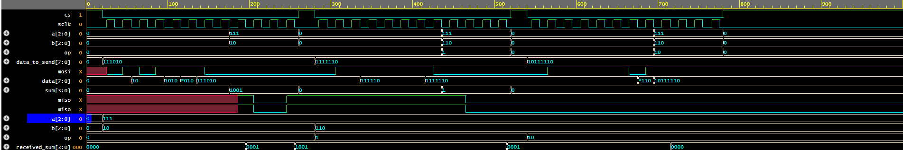

# SPI Communication in SystemVerilog

## Overview
This project implements a Serial Peripheral Interface (SPI) communication system in SystemVerilog. The design includes a **Master**, **Slave**, and **Testbench** with an **Interface** to facilitate SPI transactions. The SPI protocol is implemented with basic arithmetic operations as part of the data transmission.

## Features
- Implements an **SPI Master** and **SPI Slave** module
- Uses **interface-based design** for clean communication
- Supports **ADD, SUB, INV, and RED** operations on 3-bit operands
- Displays debug messages in the console
- Generates a **waveform for visualization**

## File Structure
```
|-- spi_project/
    |-- interface.sv         # SPI Interface definition
    |-- master.sv            # SPI Master module
    |-- slave.sv             # SPI Slave module
    |-- testbench.sv         # Testbench for simulation
    |-- dump.vcd             # Generated waveform file
    |-- waveform.jpg         # Visualization of signals (to be added)
    |-- README.md            # Project documentation
```

## SPI Protocol Implementation
### Master Module (`master.sv`)
- Generates **clock signal (sclk)**
- Sends **8-bit data** (Opcode + Operand A + Operand B)
- Receives **4-bit result** from the Slave

### Slave Module (`slave.sv`)
- Receives **8-bit data** from the Master
- Performs arithmetic operation based on **Opcode**
- Sends **4-bit result** back to Master

### Interface (`interface.sv`)
Defines the SPI signals:
```systemverilog
interface spi_if;
  logic mosi;  // Master Out Slave In
  logic miso;  // Master In Slave Out
  logic sclk;  // Serial Clock
  logic cs;    // Chip Select
endinterface
```

## Running the Simulation
### Prerequisites
- **Verilog/SystemVerilog Simulator** (e.g., ModelSim, VCS, or Verilator)

### Compilation and Execution
```sh
# Compile the project
vlog interface.sv master.sv slave.sv testbench.sv

# Run the simulation
vsim -c -do "run -all"
```

## Expected Output
- Console messages displaying transmitted and received data
- **waveform.vcd** file for analysis

## Waveform Visualization




## Contributing
Feel free to open issues or submit pull requests to improve the project!

## License
MIT License

